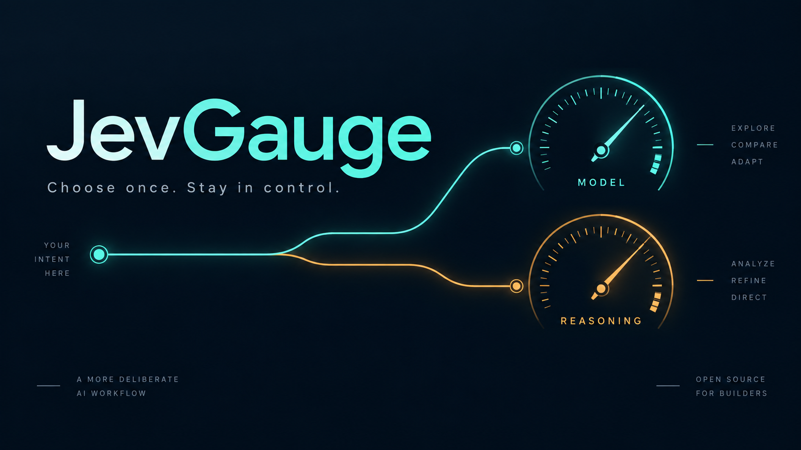
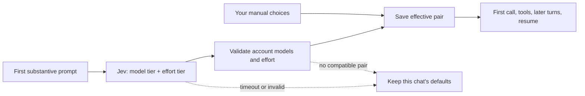

<p align="center"></p>

# JevGauge

**One prompt. Two decisions. Your conversation stays yours.**

JevGauge asks [Jev](https://docs.typesafe.ai/introduction/quickstart) to choose a model tier and a separate reasoning tier when a new Hermes Desktop chat starts. Hermes binds the effective pair before its first provider call. Later messages use that binding. Your manual choices always take precedence.

> **Developer preview, v0.1.** This is a working two-part POC: a user-scoped plugin plus a proposed generic Hermes integration. **It does not work on an unmodified Hermes release yet.** The installer checks compatibility and refuses unsupported checkouts. It never silently patches Hermes. Start with the [compatibility and integration guide](docs/hermes-integration.md).

[Install](#install) · [Try it](#try-it) · [Manual control](#stay-in-control) · [Privacy](#what-leaves-your-machine) · [Tests](#development) · [Upstream proposal](docs/upstream-proposal.md)

## What it does

- **Chooses once.** The first substantive message triggers one Jev decision. Tool calls, later turns, and resume do not retrigger it.
- **Separates capacity from effort.** A small model can still get high reasoning. These are independent decisions, validated as a pair.
- **Keeps you in charge.** `/model` and `/reasoning` own their respective fields. Compatible manual effort survives a later model change.
- **Fails open.** Missing credentials, timeouts, invalid decisions, or no compatible candidates preserve the conversation's original defaults.
- **Shows its work.** A live panel shows choosing, the effective pair, ownership, and a concise policy label. Minimize it or keep it open. `/jev-status` provides a text view.



Jev returns typed choices. The displayed reason is a local policy label, **not** generated chain of thought. “Route selected” means a binding was chosen; provider acceptance is verified separately.

## Compatibility

| Area | v0.1 status |
|---|---|
| Surface | Hermes Desktop, gateway launch profile |
| Provider | Authenticated ChatGPT / Codex subscription (`openai-codex`) |
| Hermes version | Pinned development checkout plus the explicit integration patch |
| Stock Hermes releases | Not supported until the generic hook ships upstream |
| Other providers, TUI, messaging, subagents | Not routed |
| Sibling profiles hosted in the same backend | Skipped to preserve credential isolation |
| Installer and policy | Python 3.10+, CI matrix for Linux, macOS, Windows |
| Live Desktop/provider verification | macOS; first call and resumed turn verified locally |

A green unit-test matrix is not evidence of live Desktop behavior on every OS. Model availability depends on your account. The configured model tiers are intersected with the authenticated account catalog; static model lists are not entitlement evidence.

## Install

### 1. Prepare Hermes

Install and authenticate [Hermes](https://hermes-agent.nousresearch.com/docs/). Select its ChatGPT subscription provider. Then follow the [explicit development integration procedure](docs/hermes-integration.md). This step is required until upstream ships the hook.

### 2. Install JevGauge's tooling

```sh
git clone https://github.com/PraveenKumarSridhar/jevgauge.git
cd jevgauge
python -m venv .venv
```

Activate the environment:

```sh
# macOS / Linux
source .venv/bin/activate
```

```powershell
# Windows PowerShell. Use a Python 3.10+ installation.
.\.venv\Scripts\Activate.ps1
```

If your shell does not permit activation, invoke `.venv/bin/python` or `.venv\Scripts\python.exe` directly in place of `python` below.

```sh
python -m pip install .
python -m jevgauge doctor --hermes-repo /path/to/hermes-agent
```

`doctor` is a static API check. It does not read credentials, contact providers, or prove a live call. Quote paths that contain spaces. `--home /path/to/hermes-home` selects a non-default launch home; otherwise `HERMES_HOME` or `~/.hermes` is used.

### 3. Add your Jev key and install the plugin

Get a TypeSafe key from the [TypeSafe dashboard](https://console.typesafe.ai/). Add `TYPESAFE_API_KEY` to your Hermes secret environment, for example by editing the `.env` file in your Hermes home. Do not put the key in this repository or `config.yaml`.

Close Hermes Desktop before editing its configuration or running installer commands. Then:

```sh
python -m jevgauge install --hermes-repo /path/to/hermes-agent
```

Restart the integrated Desktop build. The installer copies the plugin into `<home>/plugins/jev-router` and enables it. The internal plugin ID remains `jev-router`; its display name is JevGauge.

The installer preserves unrelated YAML values, but normalizes YAML formatting/comments. It refuses unmanaged directories, development symlinks, and modified managed files. It never writes your API key. [Installer details](docs/installation.md).

## Try it

1. Start a **new Desktop chat**. Send: `Convert "neon signals after midnight" to title case. Return only the result.`
2. Watch **CHOOSING → ROUTE SELECTED**. Inspect the model and reasoning independently.
3. Send `Reply with exactly SECOND.` The pair should stay the same, with no second Jev decision.
4. Run `/reasoning high`. The effort becomes manual. Later messages must retain it.
5. Quit and reopen Desktop, resume that conversation, and send `Reply with exactly RESUMED.` Verify the saved pair.

The panel's **Minimize / Details** control remembers your display preference. It does not disable routing. `/jev-status` reports the saved binding and owners.

For actual request evidence, inspect `<home>/logs/agent.log` for `Codex request route`. Its provider, model, and effort should match the effective binding. Do not share raw logs without checking them for private content. See the [test checklist and observed evidence](docs/verification.md).

## Stay in control

```text
/reasoning high
/model <eligible-model-id> --reasoning high
```

A manual field stays manual. Jev does not reset it on the next turn. Incompatible explicit model/effort pairs should be rejected rather than silently changing your setting. A new chat gets a new routing decision.

To keep manual reasoning in **all new chats**, set Hermes's profile effort (`/reasoning high --global`), then add `effort_mode: manual` under this plugin's settings. Restart Desktop. Jev can still choose the model. Restore `effort_mode: auto` to allow automatic effort selection for future chats.

```yaml
plugins:
  enabled:
    - jev-router  # retain your other enabled plugins
  entries:
    jev-router:
      settings:
        enabled: true
        effort_mode: auto
        selection_timeout: 5.0
```

The overall routing wait is capped at five seconds by default, with two-second HTTP operation limits, response size limits, and bounded worker concurrency. `selection_timeout` accepts 0.01 to 10 seconds. An expired selection cannot change the conversation later.

`tier_models` overrides the ordered `economical`, `balanced`, and `strongest` candidate lists. See [configuration](docs/configuration.md). Jev confidence below 0.55 on either choice retains defaults; this is a policy threshold, not calibrated accuracy.

### Enable, disable, remove

Close Desktop first; restart after each change. Use the same `--home` for every command if you installed into a custom home.

```sh
python -m jevgauge disable
python -m jevgauge enable --hermes-repo /path/to/hermes-agent
python -m jevgauge uninstall
```

Disabling affects new routing. Existing conversations keep their saved bindings. Uninstall removes only unchanged installer-owned plugin files; it preserves custom settings and unknown files. Upgrades use disable → uninstall → install. Existing development symlinks need deliberate migration, never forced overwrite.

## What leaves your machine

One Jev request sends **up to the first 1,200 characters of the first substantive user message**, a Jev model name, and two fixed typed-choice questions. The default endpoint is `https://api.typesafe.ai/v1/systemone`.

No attachments, later conversation history, tool results, or ChatGPT credentials are included. Your TypeSafe key goes in the authorization header. Account discovery uses your existing authenticated Hermes route. Custom endpoints must use HTTPS.

The plugin stores the effective pair, owners, candidate set, versions, and policy reason with the conversation. It does not log the prompt or dependency exception text.

## Development

```sh
python -m pip install '.[test]'
python -m pytest
python -m build
```

Tests run without Hermes installed and without provider credentials. HTTP boundaries use mock transports; the installer uses temporary homes. The separate integration workflow applies the public patch to a pinned clean Hermes checkout and runs lifecycle tests with Hermes's canonical test runner. [Verification details](docs/verification.md).

We work in small commits: regression test → fix → independent adversarial review → commit. Found a bug? Include OS, Python version, Hermes commit, route status, and a redacted reproduction in an [issue](https://github.com/PraveenKumarSridhar/jevgauge/issues).

## Upstream path

The generic hook, durable binding, manual-override handling, and optional Desktop status panel belong in Hermes. Jev policy belongs here. The integration patch is public and versioned, not hidden in an installer. See the [upstream proposal](docs/upstream-proposal.md) for the API and acceptance tests.

Token counts do not measure subscription quota savings. The contract here is a visible, one-time decision with durable manual control.

MIT licensed. Independent project, not affiliated with or endorsed by Nous Research or TypeSafe. Hero artwork is generated concept art, not a screenshot. [Third-party notices](THIRD_PARTY_NOTICES.md).
