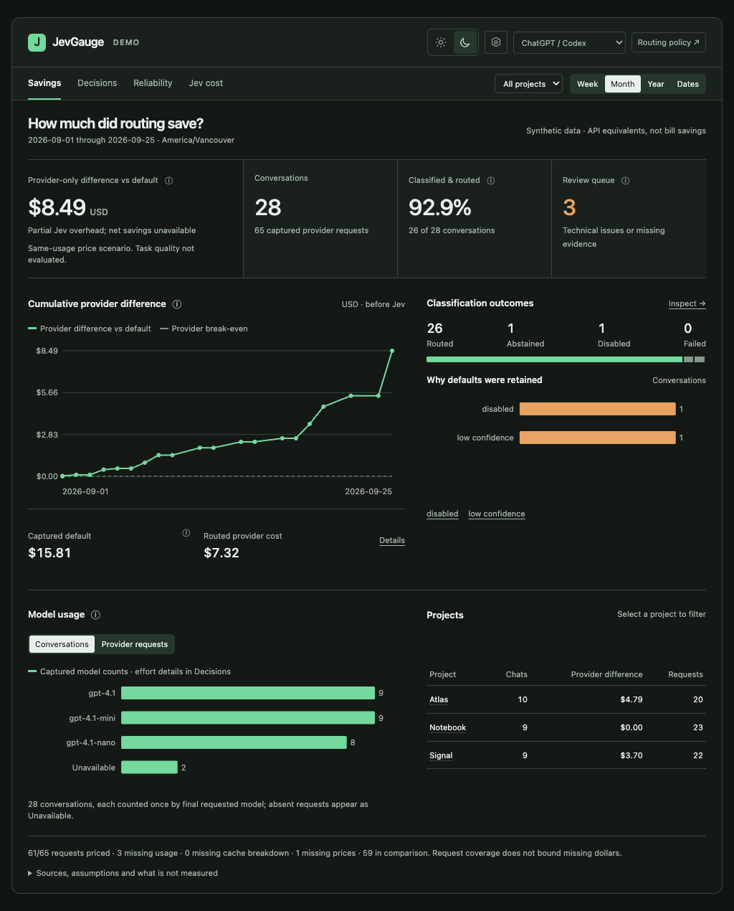

# Approved V5 acceptance matrix

Implementation baseline: `c4c5e44`, which matched clean `origin/main`. Baseline tests: 74 passed. Branch: `codex/approved-v5-dashboard`. Verification uses deterministic providers and temporary Hermes homes; active Hermes and credentials are unchanged.

| Requirement | Status | Current evidence |
|---|---|---|
| Correct remote and unchanged baseline | Verified | `origin` is `PraveenKumarSridhar/jevgauge`; baseline 74 tests; previous remote main CI successful |
| V5 only; reference preserved and privacy reviewed | Verified | [Approved HTML](design/approved-dashboard-v5.html), [original acceptance copy](design/v5-acceptance.md); HTML SHA unchanged; no personal names, emails, credentials or user filesystem paths found; expired preview URL sanitized in notes only |
| Savings, Decisions, Reliability, Jev cost; faithful themes/layout | Verified | [Frontend evidence](frontend-verification.md), desktop and 352px screenshots below; V5 CSS/DOM retained with documented evidence-driven differences |
| Shared filters, all date dismissals, invalid range preservation, stable model chart, Details/help | Verified | Browser scenarios exercise interactions, not element existence; model chart bounding boxes unchanged at 166px height |
| Real evidence API and isolated labeled demo | Verified | Live callback → SQLite → HTTP → browser scenario; demo uses separate in-memory events/config; empty/error/loading/incomplete cases |
| Pre-route defaults, selection, eligible tiers, actual physical requests, reported values, retries/fallback/manual provenance | Verified, scoped | [Telemetry contract and scope](telemetry.md); physical Codex Responses hook preserves raw usage; unsupported transports remain disclosed |
| Cache/reasoning accounting, retry/rejection usage, historical default and eligible baselines | Verified | 39 accounting tests including 11 independent cases with hand calculations; [accounting review](accounting-review.md) |
| Unknown prices/usage, cache breakdown coverage, overhead once or unavailable, distinct review union | Verified | Independent regressions include incomplete cache, corrupt rate data, overlapping flags and healthy disabled/confidence-only requests |
| Versioned official USD rates and visible limitations | Verified | Exact IDs, dates, units and official model-page sources in `pricing.json`; independent source checks; unknown GPT-6 prices remain unavailable |
| Concurrent/idempotent store, migration, partial records, persistence, cold resume | Verified | Storage tests include 50 concurrent writes, conflicting replays, v0 creation/future-version refusal; fresh Hermes subprocess resumes without rerouting |
| Failure isolation and prompt/secret exclusion | Verified | Broken observer import and storage failure preserve provider behavior; whitelist/malformed stored payload tests; no prompts or raw provider bodies stored |
| Working Hermes dashboard opening workflow | Verified, controlled | Actual plugin discovery and Desktop command dispatcher launch real child HTTP service; identity/home reuse checked. Browser launcher stub records URL, actual browser rendering tested separately |
| Config validation, preservation, revision protection, supported installation and restart semantics | Verified | Snapshot/hash race, unowned/legacy install, aliases, stale writes, lock/symlink, empty tier and field-validation regressions |
| Loopback, Host/Origin/CSRF, safe text, bounded input/resources | Verified | Raw malformed-request and header tests, escaped stored text, no CORS/external scripts; one history calculation, 16 bounded handlers, 64KiB write body, 50,000-event cap |
| Inclusive dates, timezones/DST, empty windows, large histories | Verified | 23/25-hour Los Angeles days, historical route outside range, 10k/50k cases; 50k about 1s and about 272MiB measured, not a multi-user load claim |
| Required assets packaged and installed outside checkout | Verified | Wheel inspection plus real installed-wheel HTTP asset/demo smoke in isolated environment; legacy safe uninstall/reinstall retained |
| Deterministic route → persistence → API → dashboard | Verified | Independent known example: provider $0.0005, captured default $0.0025, difference $0.0020; net unavailable without overhead |
| Existing regressions and pinned Hermes checks | Verified locally | Final Python suite 173 passed; pinned Hermes canonical suite 61 passed across 10 files; Desktop Vitest 14 passed across 2 files |
| Browser and accessibility verification | Verified locally | Final 11 Chrome scenarios, no skipped tests; five-screen Axe checks, keyboard/focus, real demo/live services and light/dark desktop/mobile inspection |
| Independent review, findings reproduced and resolved | Verified | [Accounting](accounting-review.md), [reliability](reliability-review.md), frontend cross-review of browser-launch errors; fixes cross-inspected and affected checks rerun |
| Draft PR and final running preview | Verified | [Draft PR #1](https://github.com/PraveenKumarSridhar/jevgauge/pull/1), branch `codex/approved-v5-dashboard`; detached final-wheel DEMO at `http://127.0.0.1:8766/`, browser and data checked after restart; no merge/release/public deployment |

## Reviewed screenshots

These show isolated synthetic demo activity, not actual usage or bills.

[Light narrow-screen screenshot](screenshots/v5-light-mobile.png)

## Explicit verification boundaries

- No paid provider calls, real account catalog validation, signed-in Desktop trial, subscription bill measurement, or task-quality evaluation was performed.
- The supported host is the exact pinned checkout plus the explicit patch. Stock upstream Hermes, other provider families, Codex app-server transport, auxiliary requests, bots, memory context and per-project policy remain unsupported.
- Production project attribution and measured Jev billing are currently unavailable. Capture cannot prove completeness of telemetry that never arrived. No historical evidence is fabricated.
- Current-price API-equivalent comparisons do not prove causal savings. Missing request counts do not bound missing dollars. The known GPT-4.1 rate snapshot does not price unknown account model IDs.
- Storage beyond 50,000 events returns an explicit bounded-history error rather than partial totals. Configuration writes require closing/restarting Desktop. Disabling plugin loading removes its slash commands after restart; the standalone CLI remains available.
- Local checks are complete. Remote CI status is tracked on the draft PR and must be distinguished from these local results.
