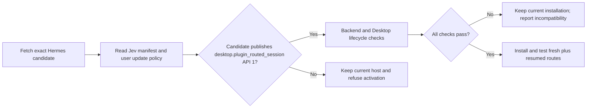

# Hermes update compatibility

JevGauge's policy, route API, and native Desktop indicator are packaged in this repository and installed under the Hermes user home. Replacing the Hermes app bundle does not delete those files. The stock fallback selects before `session.create`, submits the first prompt, and opens the stored session through public plugin APIs. Automatic routing from the ordinary composer still requires the optional native route contract. The installer checks for either complete seam and never modifies Hermes source.

The backend manifest requires `desktop.plugin_routed_session` API 1. Installation also sets `plugins.entries.jev-router.update_admission: required`. A gate-aware Hermes updater reads those two data declarations before activating a fetched Git tree or extracted ZIP. A candidate that does not publish API 1 is refused while the current checkout remains active. Plugin code is not imported during this check, and an ordinary plugin without the explicit config policy cannot veto an application update.

The router declares no third-party Python runtime dependencies. Its bounded HTTPS client uses the standard library, so a future Hermes dependency resolution cannot evict Jev because of a shared `httpx` version conflict.



## Ownership boundaries

| Component | Location and update behavior |
|---|---|
| Routing policy, health command and telemetry | Packaged Python plugin in `<home>/plugins/jev-router`; survives an app replacement |
| Titlebar route indicator | Packaged native plugin in `<home>/desktop-plugins/jev-router`; survives an app replacement and must be enabled in Desktop Capabilities → Plugins |
| Explicit first-call selection and durable binding | Jev-owned Desktop action plus the stock routed-session host contract |
| Automatic ordinary composer routing and addressed read | Optional native `session.turn_route` contract proposed upstream |
| Update admission | Generic Hermes updater gate plus the Jev manifest and user config policy. Git admission runs after fetch and before checkout movement; ZIP admission runs after extraction and before the live-file swap |

On stock hosts without a route-read RPC, the indicator displays a requested route only for Jev-owned routed starts, then promotes it to a live binding after a matching `session.info` event. It labels other conversations unrouted. `jevgauge doctor --hermes-repo /path/to/hermes-agent` checks host symbols and ordering without changing files. A successful doctor is still not a live provider test.

## Repo-only alternatives checked

| Surface | Why it does not replace the missing host contract |
|---|---|
| General plugin hooks | Hermes documents `pre_llm_call` as context injection and `pre_api_request` as an observer whose result is ignored. Neither selects the provider before Desktop constructs an agent. See [plugin hooks](https://github.com/NousResearch/hermes-agent/blob/main/website/docs/developer-guide/plugins/index.md). |
| Model-provider plugin | A profile can register its own inference transport, but Hermes resolves the provider and model as that profile. A virtual Jev provider would need to reimplement credential resolution, protocol dispatch, effort validation and physical-attempt accounting for the real target models. This is a different, larger integration with uncertain session semantics. See [provider plugin API](https://github.com/NousResearch/hermes-agent/blob/main/website/docs/developer-guide/model-provider-plugin.md). |
| Desktop plugin SDK alone | It cannot intercept the ordinary composer. Jev combines its explicit action with `session.create` overrides before agent construction. See [Desktop plugin SDK](https://github.com/NousResearch/hermes-agent/blob/main/website/docs/developer-guide/desktop-plugin-sdk.md). |
| External update wrapper or local Git patch | It can test a specific candidate and keep a working local build. It cannot cover every official update path or make a missing API appear in an unmodified release. |

## Candidate process

For a native candidate, `doctor` inspects the generic middleware, shared resolver, and addressed read RPC without changing the checkout. `integration/compatibility.json` lists legacy candidate refs, the reviewed patch base, ordered patches and required lifecycle tests. CI reads this same manifest. Run legacy checks only in a separate Hermes checkout and interpreter:

The small `hermes-runtime-drift.patch` holds only the insertion sites whose nearby Hermes code changed. Its explicit one-line context setting is paired with the required lifecycle gate. A clean application alone is never an acceptance decision.

```sh
python scripts/check_hermes_update.py \
  --hermes-repo /path/to/candidate/hermes-agent \
  --ref EXACT_COMMIT \
  --test-python /path/to/test-python \
  --output-dir /path/outside/hermes/update-evidence
```

The checker snapshots an immutable commit, applies patches only in a disposable checkout, runs required tests and writes a receipt. It does not change the candidate source, active Hermes installation, app bundle or update settings. A passing receipt covers legacy backend lifecycle tests under the specified environment. CI reports that matrix as legacy integration and tests the packaged plugin separately against an exact native-contract commit. Before accepting a new Hermes build, also verify the native plugin against its Desktop SDK, build the app, and test a fresh route and a cold-resumed route against the physical provider request log. Keep the previous working build and user data until that acceptance passes.

Do not infer compatibility from a clean patch application or static API marker. The required acceptance boundary is route timing, durable restore, addressed read, and a fresh plus resumed Desktop check. A Hermes update can remove or change the host contract while leaving the user plugins installed. [The upstream proposal](upstream-proposal.md) describes the contract and its overlap with existing Hermes routing proposals.

The admission gate has not shipped in an official Hermes release. Stock updaters therefore cannot yet enforce the manifest requirement before activation. Until it merges and ships, test an exact candidate in a disposable checkout and do not treat plugin-file survival as update safety. The explicit routed-start path remains available whenever `doctor` detects the baseline seam, even if the optional automatic route hook is absent.
