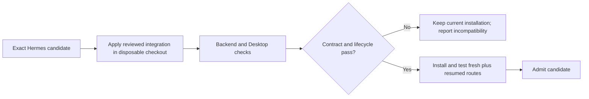

# Hermes update compatibility

JevGauge's policy and native Desktop indicator are packaged in this repository and installed under the Hermes user home. Replacing the Hermes app bundle does not delete those files. Automatic first-call routing still requires a Hermes host contract that stock releases do not provide. The installer checks for that contract and refuses unsupported hosts; it does not modify Hermes source.



## Ownership boundaries

| Component | Location and update behavior |
|---|---|
| Routing policy, health command and telemetry | Packaged Python plugin in `<home>/plugins/jev-router`; survives an app replacement |
| Titlebar route indicator | Packaged native plugin in `<home>/desktop-plugins/jev-router`; survives an app replacement and must be enabled in Desktop Capabilities → Plugins |
| First-call selection, durable binding and addressed read | Hermes backend integration; currently provided by the explicit, reviewed patches under `integration/` and **not** by stock Hermes |

The native indicator displays `Jev: unavailable` if the backend lacks the read contract. That is a capability diagnosis, not proof that a saved route or provider request is healthy. `jevgauge doctor --hermes-repo /path/to/hermes-agent` checks host symbols and version markers without changing files. A successful doctor is still not a live provider test.

## Candidate process

`integration/compatibility.json` lists candidate refs, the reviewed patch base, ordered patches and required lifecycle tests. CI reads this same manifest. Locally, use a separate Hermes checkout and interpreter:

```sh
python scripts/check_hermes_update.py \
  --hermes-repo /path/to/candidate/hermes-agent \
  --ref EXACT_COMMIT \
  --test-python /path/to/test-python \
  --output-dir /path/outside/hermes/update-evidence
```

The checker snapshots an immutable commit, applies patches only in a disposable checkout, runs required tests and writes a receipt. It does not change the candidate source, active Hermes installation, app bundle or update settings. A passing receipt covers backend lifecycle tests under the specified environment. Before accepting a new Hermes build, also verify the native plugin against its Desktop SDK, build the app, and test a fresh route and a cold-resumed route against the physical provider request log. Keep the previous working build and user data until that acceptance passes.

Do not infer compatibility from a clean patch application or static API marker. A stock Hermes update can remove this local backend contract, while leaving the user plugins installed. The lowest-maintenance fix is a documented, versioned host API in Hermes. [The upstream proposal](upstream-proposal.md) describes its lifecycle, capability, ownership and read requirements and the overlap with existing Hermes routing proposals. Until that contract ships, JevGauge can detect unsupported updates and supply tested integration code, but cannot guarantee automatic routing on every unmodified Hermes release.
