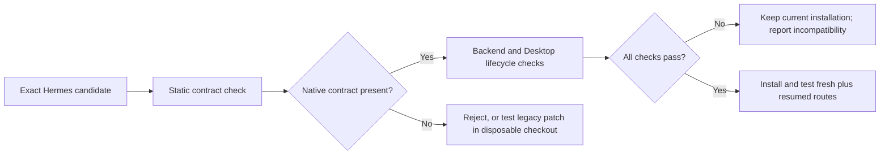

# Hermes update compatibility

JevGauge's policy and native Desktop indicator are packaged in this repository and installed under the Hermes user home. Replacing the Hermes app bundle does not delete those files. Automatic first-call routing requires a versioned Hermes host contract. The installer checks for that contract and refuses unsupported hosts; it does not modify Hermes source.



## Ownership boundaries

| Component | Location and update behavior |
|---|---|
| Routing policy, health command and telemetry | Packaged Python plugin in `<home>/plugins/jev-router`; survives an app replacement |
| Titlebar route indicator | Packaged native plugin in `<home>/desktop-plugins/jev-router`; survives an app replacement and must be enabled in Desktop Capabilities → Plugins |
| First-call selection, durable binding and addressed read | Versioned Hermes host contract. The Jev plugin consumes it but does not install it. The explicit patches under `integration/` remain a legacy development fallback |

The native indicator displays `Jev: unavailable` if the backend lacks the read contract. That is a capability diagnosis, not proof that a saved route or provider request is healthy. `jevgauge doctor --hermes-repo /path/to/hermes-agent` checks host symbols and version markers without changing files. A successful doctor is still not a live provider test.

## Repo-only alternatives checked

| Surface | Why it does not replace the missing host contract |
|---|---|
| General plugin hooks | Hermes documents `pre_llm_call` as context injection and `pre_api_request` as an observer whose result is ignored. Neither selects the provider before Desktop constructs an agent. See [plugin hooks](https://github.com/NousResearch/hermes-agent/blob/main/website/docs/developer-guide/plugins/index.md). |
| Model-provider plugin | A profile can register its own inference transport, but Hermes resolves the provider and model as that profile. A virtual Jev provider would need to reimplement credential resolution, protocol dispatch, effort validation and physical-attempt accounting for the real target models. This is a different, larger integration with uncertain session semantics. See [provider plugin API](https://github.com/NousResearch/hermes-agent/blob/main/website/docs/developer-guide/model-provider-plugin.md). |
| Desktop plugin SDK | It can render the route and make addressed RPC calls, but it does not change backend first-call selection. See [Desktop plugin SDK](https://github.com/NousResearch/hermes-agent/blob/main/website/docs/developer-guide/desktop-plugin-sdk.md). |
| External update wrapper or local Git patch | It can test a specific candidate and keep a working local build. It cannot cover every official update path or make a missing API appear in an unmodified release. |

## Candidate process

For a native candidate, `doctor` inspects the generic middleware, shared resolver, and addressed read RPC without changing the checkout. `integration/compatibility.json` lists legacy candidate refs, the reviewed patch base, ordered patches and required lifecycle tests. CI reads this same manifest. Run legacy checks only in a separate Hermes checkout and interpreter:

The small `hermes-runtime-drift.patch` holds only the insertion sites whose nearby Hermes code changed. Its explicit one-line context setting is paired with the required lifecycle gate. A clean application alone is never an acceptance decision.

```sh
python scripts/check_hermes_update.py \
  --hermes-repo /path/to/candidate/hermes-agent \
  --ref EXACT_COMMIT \
  --test-python /path/to/test-python \
  --output-dir /path/outside/hermes/update-evidence
```

The checker snapshots an immutable commit, applies patches only in a disposable checkout, runs required tests and writes a receipt. It does not change the candidate source, active Hermes installation, app bundle or update settings. A passing receipt covers backend lifecycle tests under the specified environment. Before accepting a new Hermes build, also verify the native plugin against its Desktop SDK, build the app, and test a fresh route and a cold-resumed route against the physical provider request log. Keep the previous working build and user data until that acceptance passes.

Do not infer compatibility from a clean patch application or static API marker. The required acceptance boundary is route timing, durable restore, addressed read, and a fresh plus resumed Desktop check. A Hermes update can remove or change the host contract while leaving the user plugins installed. [The upstream proposal](upstream-proposal.md) describes the contract and its overlap with existing Hermes routing proposals. Until that contract merges and ships in Hermes, JevGauge can detect unsupported updates and supply tested integration code, but cannot guarantee automatic routing on every unmodified Hermes release.
