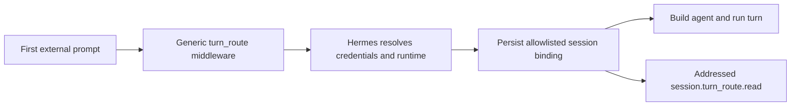

# Upstream Hermes route contract

Status: implementation in an isolated worktree, based on current Hermes `main` and stacked on open upstream `turn_route` PR [#98703](https://github.com/NousResearch/hermes-agent/pull/98703). It has not been submitted, accepted, merged, or released.

## Why this belongs in Hermes

A user plugin can own routing policy, configuration, and UI. It cannot safely choose the first model before Desktop constructs an agent unless Hermes exposes a host-owned extension point. Hermes must also keep provider credentials private, expose a profile-scoped plugin-secret reader, persist the chosen binding, restore it on resume, and provide a side-effect-free read for the Desktop indicator.

JevGauge consumes this contract from its own repository. It does not install or patch the contract into Hermes.

## Upstream overlap checked 2026-09-28

| Open proposal | Reusable boundary | Remaining gap |
|---|---|---|
| [#98703, pre-agent `turn_route`](https://github.com/NousResearch/hermes-agent/pull/98703), head `9eaa6dd8` at inspection | Public routing before agent construction; credentials stay host-owned | Desktop `tui_gateway` lifecycle, bounded reasoning selection, durable first-conversation binding, cold resume, and addressed read |
| [#118985, reasoning-effort policy](https://github.com/NousResearch/hermes-agent/pull/118985), head `8e38508f` at inspection | Host-bounded effort vocabulary and persistence | Separate from model routing and not merged at inspection |
| [#99053, `pre_llm_call` model override](https://github.com/NousResearch/hermes-agent/pull/99053), head `1e9c0bda` at inspection | Model override for an imminent call | Runs too late for a durable Desktop session binding |
| [#119031, Jev adaptive effort catalog entry](https://github.com/NousResearch/hermes-agent/pull/119031), head `90629d8f` at inspection | Jev effort policy | Effort only; does not select a model |

The implementation extends #98703 instead of creating a competing route mechanism. Reasoning effort and provider-attempt evidence remain separate follow-up contracts.

## Contract implemented in the isolated branch

### First-turn lifecycle

- Route only the first external user prompt.
- Run after prompt admission and before any agent construction.
- Serialize concurrent first submissions under the existing build lock.
- Skip internal hosted turns, tool continuation, seeded history, and explicit user model choices.
- Fail open to the original public route when middleware abstains, raises, or returns an invalid route.
- Resolve credentials only after middleware returns, inside the owning profile scope.

### Durable binding

Hermes writes an allowlisted `hermes.turn_route.binding.v1` value into the session row before building the agent. It contains status, model and reasoning ownership, public model/provider fields, a bounded reasoning effort, middleware manifest names, and an optional machine-readable reason code. It excludes API keys, base URLs, prompt text, plugin explanations, arbitrary metadata, and raw callback output.

Cold resume restores the committed runtime and binding without rerunning middleware. Explicit model changes move ownership to the user.

### Addressed read

`session.turn_route.read` requires both runtime and durable session IDs. An optional profile must match the live session without activating another profile. The read uses live memory only and does not query the database, build an agent, wait for the build lock, change attachments, or expose credentials.

The result is selection evidence. It does not prove a physical provider attempt, response, fallback, token count, or billed model.

### Failure behavior

- A binding persistence failure rejects the admitted submission and releases its running, inflight, and active-turn state.
- Agent-dependent RPCs fail promptly while the initial route is pending.
- Attachments can still mutate the session without triggering early construction.
- Operational authentication fallback stays host-side and is not persisted as the selected route.

## JevGauge migration

The repo-owned plugin now registers native `turn_route` middleware when the host exposes `TURN_ROUTE_API_VERSION = 1` and retains `select_session_runtime` as a legacy fallback. Under the native contract it selects model and reasoning independently, reads its TypeSafe token through `PluginContext.get_secret`, and lets the host validate the selected pair. It no longer imports Hermes private account-catalog or credential helpers on that path. The Desktop indicator reads `session.turn_route.read` first, then falls back to the legacy `session.runtime_selection` RPC.

The installer accepts either complete contract and rejects partial marker-only hosts. Provider-attempt telemetry is optional, so missing dashboard evidence does not disable model routing.

## Compatibility promise

A Hermes update is compatible only when the complete contract and lifecycle tests pass. User-scoped plugin files surviving an app replacement do not prove that the new host can execute them. `jevgauge doctor` is the static gate, followed by fresh-chat and cold-resume checks against the exact candidate.

Until the contract merges and appears in a Hermes release, JevGauge cannot promise routing on every unmodified release. The legacy patch remains a development fallback in a disposable checkout, not an installation strategy.

## Later work

- Compose reasoning effort through a supported host capability contract.
- Add generic provider-attempt evidence across transports, retries, fallbacks, and terminal failures.
- Define host deadlines and resource isolation for slow middleware callbacks.
- Rebase the extension after #98703 changes or merges, then submit it without duplicating the upstream implementation.
